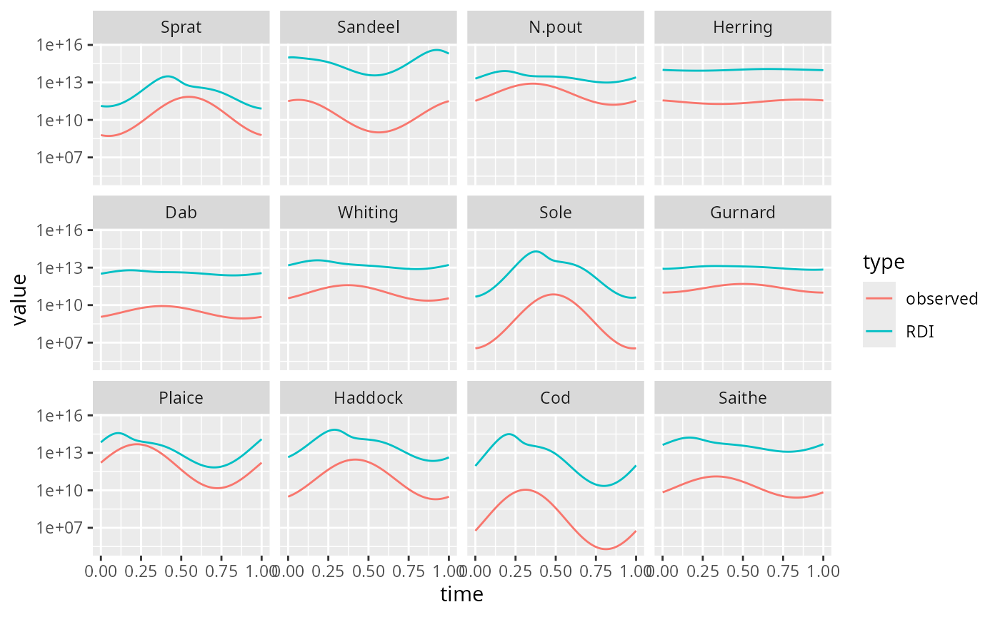

# mizerSeasonal

After you have installed the mizerSeasonal package with

``` r
remotes::install_github("gustavdelius/mizerSeasonal")
```

you can load it with

``` r
library(mizerSeasonal)
#> Loading required package: mizer
```

We demonstrate the use of the package by introducing seasonal
reproduction into the North Sea model that comes with mizer. So we load
the model, match its growth rates to observations and run it to steady
state:

``` r
p <- NS_params |> matchGrowth() |> steady(preserve = "erepro")
#> Convergence was achieved in 13.5 years.
plotlySpectra(p, power = 2)
```

This is not a particularly good model of the North Sea, but it will
suffice for demonstration purposes.

In standard mizer the way to find a good steady state for a model is to
first keep the reproduction independent of the rate of investment into
reproduction and run the dynamics until it settles down. Then one adapts
the reproduction parameters in the model so that the steady-state
investment into reproduction leads to the desired steady state
reproduction (this is what the
[`steady()`](https://sizespectrum.org/mizer/reference/steady.html)
function did above). We will follow the same method for the model with
seasonal reproduction.

Following the paper by Datta, S. & Blanchard, J. L. “The effects of
seasonal processes on size spectrum dynamics”. Canadian Journal of
Fisheries and Aquatic Sciences (2016).
<https://cdnsciencepub.com/doi/full/10.1139/cjfas-2015-0468>, we
describe the seasonal reproduction rate by the von Mises distribution \\
R\_{dd}(t) = r_0 \frac{\exp(\kappa \cos(2\pi(t - \mu)))}{2\pi
I_0(\kappa)}, \\ which looks like a Gaussian near \\t = \mu\\ but is
periodic in \\t\\ with a period of one year. The spawning season is
centred at \\\mu\\ with a length proportional to \\1/\sqrt{\kappa}\\ and
a magnitude determined by \\r_0\\. The denominator involving the Bessel
function \\I_0\\ is just a normalisation factor that makes sure that the
integral over \\R\_{dd}(t)\\ is equal to \\r_0\\.

We need to specify the new species parameters \\r_0, \kappa\\ and
\\\mu\\ (which are denoted by `rdd_vonMises_r0`, `rdd_vonMises_kappa`
and `rdd_vonMises_mu` respectively). We choose \\r_0\\ to be equal to
the reproduction rate \\R\_{dd}\\ of the non-seasonal model and we take
\\\mu\\ and \\\kappa\\ from the paper by Datta et.al.

``` r
species_params(p)$rdd_vonMises_r0 <- getRDD(p)
species_params(p)$rdd_vonMises_kappa <- 
    c(3.6047, 2.9994, 1.944, 0.40493, 1.141, 1.4257,
      4.973, 0.795, 4.0495, 3.6567, 5.4732, 1.951)
species_params(p)$rdd_vonMises_mu <- 
    c(0.5477, 0.0643, 0.3574, 0.8576, 0.3825, 0.3716,
      0.4856, 0.5021,0.2245, 0.4181, 0.3123, 0.3333)
```

We also need to set the mass-specific gonad release rate \\r(t)\\ so
that mizer can calculate the gonadic mass. Unfortunately we do not know
which release rate \\r(t)\\ produces the steady-state reproduction rate
that we have chosen above. We will try a vonMises distribution with the
same \\\kappa\\ and \\\mu\\ parameters as above and with \\r_0\\ chosen
large enough so that most of the gonadic mass is released every year. We
will then later set the parameters of the Beverton-Holt function to
produce the desired reproduction rate.

``` r
species_params(p)$vonMises_r0 <- 100
species_params(p)$vonMises_kappa <- species_params(p)$rdd_vonMises_kappa
species_params(p)$vonMises_mu <- species_params(p)$rdd_vonMises_mu
```

Seasonal reproduction is then turned on with

``` r
p <- setSeasonalReproduction(p, release_func = "seasonalVonMisesRelease",
                             RDD = "seasonalVonMisesRDD")
```

The resulting MizerParams object can be projected into the future as
usual with
[`project()`](https://sizespectrum.org/mizer/reference/project.html) to
produce a MizerSim object.

``` r
sim <- project(p, t_max = 50, dt = 0.01)
plotlyBiomass(sim)
```

We see that the system has settled down to a steady state quite quickly.

To see the variation within the year we project for a further year but
with higher time resolution

``` r
ps <- setInitialValues(p, sim)
sim1 <- project(ps, t_max = 1, dt = 0.01, t_save = 0.01)
plotlyBiomass(sim1)
```

Let us look at an animation of the size spectrum for one year. We first
re-run the simulation while storing fewer intermediate times to make the
animation render more quickly.

``` r
sim1l <- project(ps, t_max = 1, dt = 0.01, t_save = 0.1)
animateSpectra(sim1l, power = 2)
```

Hit the “Play” button to see the size spectra evolve over the course of
a year. Because we are in the steady state, the next year will again
look the same, so you can simply play the above simulation repeatedly.

We notice that, while the seasonal reproduction has a big effect on the
seasonal variation of the abundance of larvae, the abundance of mature
fish remains unaffected. The cohort peaks are damped while they move up
the size spectrum and disappear almost completely by the time they reach
the maturity size.

As a result, when we animate the gonadic spectrum, i.e., the size
distribution of the total gonadic mass of each species, the shape of the
distribution does not change much but simply moves up and down during
the year due to the seasonal release rate and the constant creation of
gonadic mass.

``` r
animateGonadSpectra(sim1l)
```

We can take a look at the rate \\R\_{di}\\ of reproduction before
density dependence and the desired rate \\R\_{dd}\\ that should remain
after imposing an \\R\_{max}\\. Both vary throughout the year:

``` r
rdi <- getTimeseries(sim1, func = getRDI)
rdd <- getTimeseries(sim1, func = getRDD)
# build data frame for ggplot
rdi_df <- melt(rdi)
rdi_df$type <- "RDI"
rdd_df <- melt(rdd)
rdd_df$type <- "observed"
df <- rbind(rdi_df, rdd_df)
# Make plot with one panel per species
library(ggplot2)
ggplot(df) + 
    geom_line(aes(x = time, y = value, colour = type)) +
    facet_wrap(vars(sp)) +
    scale_y_log10()
```



We now set the maximum reproduction rate \\R\_{max}(t)\\ so that the
density-dependent reproduction \\R\_{dd}\\ produced by the Beverton Holt
function \\ R\_{dd} = R\_{di}\frac{R\_{max}}{R\_{di}+R\_{max}} \\ agrees
with the observed reproduction rate.

``` r
other_params(ps)$r_max <- rdi * rdd / (rdi - rdd)
ps <- setRateFunction(ps, "RDD", "seasonalBevertonHoltRDD")
```
